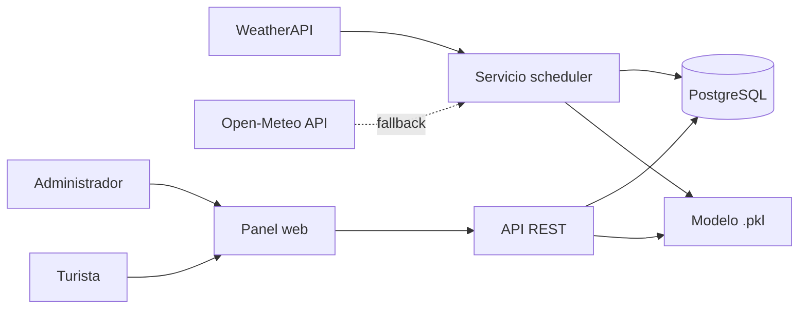

# Predicción de visitantes a Las Pavas según el clima
> Este spec asume ya leídos `architecture-specs.md`, `infraestructure-specs.md`
> y `login-specs.md`. La predicción convive con el módulo de consulta del
> clima (ver `condicional-api-specs.md`): son dos módulos del mismo sistema.

## 1. Resumen y objetivo
El sistema predice cuántas personas visitarán la Cueva de Las Pavas (Tingo
María) en los próximos días (horizonte de 1 a 3 días) a partir del pronóstico del clima. Se despliega
en la nube (AWS) y ayuda a la administración del atractivo a planificar
personal, boletería y seguridad.

**Objetivo:** estimar la cantidad diaria de visitantes con un error medio
(MAE) menor a 10 personas, usando clima, día de la semana, feriados y
temporada de vacaciones.

## 2. Alcance
**Incluye:**
- Obtención automática del clima histórico y del pronóstico de los próximos días.
- Almacenamiento de clima, visitas y feriados en PostgreSQL.
- Entrenamiento y reentrenamiento del modelo predictivo.
- Consulta de predicciones vía API y un panel web sencillo.

**No incluye:**
- Venta de boletos ni pagos en línea.
- Conteo automático de personas (sensores, cámaras).
- Predicción por hora; solo por día.
- Otros atractivos distintos de Las Pavas (ver trabajo futuro).

## 3. Usuarios
| Actor | Qué hace en el sistema | ¿Necesita login? |
|---|---|---|
| Administrador de Las Pavas | Consulta predicciones, registra las visitas reales del día, gestiona feriados, reentrena y ve métricas | Sí |
| Municipalidad / oficina de turismo | Revisa tendencias para planificar recursos | No (vista pública) |
| Turista | Consulta si habrá mucha o poca gente antes de ir | No (vista pública) |
| Sistema (proceso automático) | Descarga el clima diario y reentrena el modelo | — |

> Todos los usuarios de la tabla `users` son administradores (no hay roles
> por ahora). El login es solo para el administrador.

## 4. Requisitos funcionales
| ID | Requisito | Prioridad |
|---|---|---|
| RF-01 | El sistema descarga cada día a las 06:00 (hora de Lima) el pronóstico diario de Tingo María para el horizonte máximo (`PREDICCION_HORIZONTE_DIAS`), con el flujo WeatherAPI → Open-Meteo. | Alta |
| RF-02 | El sistema guarda el clima diario (temp. máx., temp. mín., lluvia en mm, humedad). | Alta |
| RF-03 | El administrador registra la cantidad real de visitantes de cada día. | Alta |
| RF-04 | El sistema genera la predicción de visitantes para los próximos 1 a 3 días (máximo configurable por `.env`). | Alta |
| RF-05 | El usuario consulta la predicción por fecha desde el panel web o la API. | Alta |
| RF-06 | El sistema clasifica cada día como afluencia Baja (< 30), Media (30–60) o Alta (> 60). | Media |
| RF-07 | El sistema reentrena el modelo cada semana (lunes 03:00, hora de Lima) con los datos nuevos. | Media |
| RF-08 | El sistema muestra un gráfico de visitas reales vs. predichas. | Media |
| RF-09 | El administrador gestiona el calendario de feriados. | Baja |

## 5. Requisitos no funcionales
| ID | Tipo | Requisito |
|---|---|---|
| RNF-01 | Rendimiento | La API responde una predicción en menos de 2 segundos. |
| RNF-02 | Disponibilidad | El servicio está disponible al 99% del tiempo mensual. |
| RNF-03 | Precisión | El modelo tiene MAE < 10 visitantes y R² ≥ 0.80 en datos de prueba. |
| RNF-04 | Escalabilidad | La base de datos soporta al menos 10 años de registros diarios sin cambios de diseño. |
| RNF-05 | Seguridad | Solo el administrador autenticado puede registrar o editar visitas. La API usa HTTPS. |
| RNF-06 | Usabilidad | El panel funciona en celular y está en español. |
| RNF-07 | Tolerancia a fallos | Si WeatherAPI y Open-Meteo fallan, el sistema reintenta el flujo completo 3 veces y, si sigue fallando, usa el último pronóstico guardado. |

## 6. Fuentes de datos
| Dato | Fuente | Tipo |
|---|---|---|
| Clima histórico (2023–2025) | Open-Meteo Historical API (`OPEN_METEO_ARCHIVE_URL`) | Real |
| Pronóstico diario (1 a 3 días) | WeatherAPI Forecast, con fallback a Open-Meteo Forecast | Real |
| Visitantes diarios | Generados por simulación | Sintético |
| Feriados | Calendario oficial de feriados de Perú (cargado por seed) | Real |

- Coordenadas de Tingo María: `PREDICCION_LAT` / `PREDICCION_LON` del `.env`.
- El pronóstico usa el **mismo flujo WeatherAPI → Open-Meteo** que la consulta
  del clima (mismos clientes, mismas excepciones; ver
  `condicional-api-specs.md`, sección "PRONÓSTICO DIARIO"). El pronóstico
  descargado se guarda en la tabla `clima` (`es_pronostico = true`), que
  cumple el papel de caché de pronósticos.
- El clima histórico 2023–2025 (solo para entrenar) sale únicamente de
  Open-Meteo Archive: el historial de WeatherAPI requiere plan de pago.

### Datos de visitas sintéticos
No existe un registro público de visitantes de Las Pavas. Para el prototipo
se simulan con reglas:
- Base de 40 visitantes/día
- +80% en fin de semana
- +100% en feriados
- +40% en vacaciones (enero–marzo y julio)
- Reducción según la lluvia

En producción se reemplazan por el registro real de boletería (RF-03).

## 7. Modelo de datos
PostgreSQL, cuatro tablas unidas por fecha (fechas de tipo `date`,
marcas de tiempo `timestamptz`).

| Tabla | Campos | Clave |
|---|---|---|
| clima | fecha, temp_max (°C), temp_min (°C), lluvia_mm, humedad (%), es_pronostico | PK: fecha |
| visitas | fecha, cantidad_visitantes, es_sintetico, registrado_por (FK → users.id, nulo si es sintético) | PK: fecha |
| feriados | fecha, nombre | PK: fecha |
| predicciones | id, fecha_objetivo, visitantes_predichos, nivel_afluencia, version_modelo, entrenado_con_sinteticos, dato_incompleto, creado_en | PK: id |

- `es_sintetico` separa los datos simulados de los reales, para poder
  sacarlos cuando haya registros reales.
- `es_pronostico` distingue el pronóstico del clima observado; cuando llega
  el dato observado de una fecha, reemplaza al pronóstico
  (`ON CONFLICT (fecha) DO UPDATE`).
- `nivel_afluencia`: CHECK IN ('Baja', 'Media', 'Alta').

## 8. Modelo predictivo
Random Forest de regresión (scikit-learn), porque captura relaciones no
lineales (por ejemplo, lluvia fuerte en feriado) y funciona bien con pocos datos.

| Variable | Tipo | Descripción |
|---|---|---|
| lluvia_mm | Entrada | Lluvia prevista del día |
| temp_max, temp_min | Entrada | Temperatura prevista (°C) |
| dia_semana | Entrada | 0 = lunes … 6 = domingo |
| fin_semana | Entrada | 1 si es sábado o domingo |
| feriado | Entrada | 1 si es feriado nacional |
| vacaciones | Entrada | 1 en enero–marzo y julio |
| mes | Entrada | 1–12 |
| cantidad_visitantes | Salida | Personas estimadas en el día |

- **Entrenamiento:** 80% de los datos para entrenar y 20% para prueba.
  Métricas: MAE y R².
- En el prototipo con datos sintéticos se obtuvo MAE de 5.8 visitantes y
  R² de 0.91; la variable más influyente fue la lluvia.
- **Modelo guardado:** archivo `.pkl` versionado (`modelo_v{n}.pkl`) en el
  volumen `modelos` de Docker, junto con sus métricas. La API usa siempre la
  última versión.

## 9. Arquitectura en la nube (AWS)


Todo corre en la instancia EC2 con Docker (ver `infraestructure-specs.md`):

| Componente | Dónde | Función |
|---|---|---|
| Tareas programadas | Servicio `scheduler` en docker-compose (misma imagen del backend, APScheduler, zona horaria America/Lima) | Descarga el clima a las 06:00, genera las predicciones y reentrena cada semana |
| Base de datos | Servicio `db` (PostgreSQL 16) | Guarda clima, visitas, feriados y predicciones |
| API + modelo | Servicio `backend` (Python + FastAPI) | Expone endpoints y ejecuta el modelo |
| Panel web | Servicio `frontend` (React + nginx) | Interfaz para administrador y turistas |
| Modelo guardado | Volumen `modelos` | Archivos `.pkl` versionados |

### Flujo diario (06:00, hora de Lima)
1. Descarga el pronóstico diario del horizonte máximo con WeatherAPI; si
   falla, con Open-Meteo. Lo guarda en `clima` (`es_pronostico = true`).
2. Si ambos proveedores fallan: reintenta el flujo completo 3 veces; si sigue
   fallando, usa el último pronóstico guardado (RNF-07).
3. Genera las predicciones del horizonte con la última versión del modelo y
   las guarda en `predicciones`.

El flujo diario también se ejecuta una vez:
- al desplegar (`python -m jobs.flujo_diario`, ver `ci-specs.md`), y
- cada vez que arranca el servicio `scheduler` (si falla, solo se registra
  en el log y se espera a las 06:00).

### Flujo semanal (lunes 03:00, hora de Lima)
- Reentrena el modelo con todos los datos (`clima` + `visitas`), guarda una
  nueva versión del `.pkl` y sus métricas.

## 10. Endpoints de la API
| Método | Ruta | Descripción | Acceso |
|---|---|---|---|
| GET | /api/v1/predicciones?dias=N | Predicción de los próximos N días (1 ≤ N ≤ `PREDICCION_HORIZONTE_DIAS`, por defecto 3); fuera de rango → 400 | Público |
| GET | /api/v1/predicciones/{fecha} | Predicción de una fecha | Público |
| POST | /api/v1/visitas | Registrar visitantes reales de un día | Administrador |
| GET | /api/v1/visitas?desde=&hasta= | Historial de visitas | Administrador |
| GET | /api/v1/feriados?anio= | Lista de feriados del año | Administrador |
| POST | /api/v1/feriados | Agregar feriado `{ "fecha", "nombre" }`; si la fecha ya existe → 409 | Administrador |
| DELETE | /api/v1/feriados/{fecha} | Quitar feriado → 200 con `{ "fecha", "nombre" }` del feriado quitado; si no existe → 404 | Administrador |
| POST | /api/v1/modelo/reentrenar | Forzar reentrenamiento | Administrador |
| GET | /api/v1/modelo/metricas | MAE, R² y versión del modelo actual | Administrador |

- "Administrador" = requiere `Authorization: Bearer <jwt>` (ver
  `login-specs.md`); sin token válido → 401.
- Para una fecha con varias predicciones se devuelve la más reciente
  (mayor `creado_en`).
- `GET /api/v1/predicciones/{fecha}` sin predicción guardada para esa fecha → 404.
- `POST /api/v1/visitas` con body `{ "fecha", "cantidad_visitantes" }`: si ya
  existe un registro de esa fecha (real o sintético) lo reemplaza, con
  `es_sintetico = false` y `registrado_por` = administrador del token.
- `GET /api/v1/visitas?desde=&hasta=` devuelve por cada fecha
  `{ "fecha", "cantidad_visitantes", "es_sintetico", "visitantes_predichos" }`
  (`visitantes_predichos` = última predicción de esa fecha o `null`); es la
  fuente de datos del gráfico real vs. predicho (RF-08).
- Si el modelo no está entrenado o no carga → 503, sin predicción.
- Toda respuesta de predicción incluye `version_modelo`, `entrenado_con_sinteticos`
  y `dato_incompleto` (true si el proveedor no informó la lluvia y se usó 0).
- Las reglas de negocio de la predicción están en `business-rules-specs.md`
  ("Reglas de predicción").

Ejemplo de respuesta de `GET /api/v1/predicciones/2026-09-27`:
```json
{
  "fecha": "2026-09-27",
  "visitantes_predichos": 68,
  "nivel_afluencia": "Alta",
  "lluvia_mm": 0.0,
  "temp_max": 31.2,
  "version_modelo": 3,
  "entrenado_con_sinteticos": true,
  "dato_incompleto": false
}
```

## 11. Criterios de aceptación
- [ ] Dado un pronóstico disponible, cuando el usuario consulta
  `/api/v1/predicciones?dias=3`, recibe 3 predicciones con fecha, cantidad
  y nivel de afluencia.
- [ ] Si `dias` está fuera del rango 1 a `PREDICCION_HORIZONTE_DIAS` → 400.
- [ ] Si el modelo no está entrenado → 503.
- [ ] Dado un día con lluvia > 15 mm, la predicción es menor que la de un día
  seco equivalente (mismo día de la semana).
- [ ] Dado un feriado o fin de semana, la predicción es mayor que la de un
  día laborable con clima similar.
- [ ] El modelo cumple MAE < 10 y R² ≥ 0.80 en el conjunto de prueba.
- [ ] Un usuario no autenticado no puede registrar visitas (respuesta 401).
- [ ] Si WeatherAPI falla, el pronóstico se obtiene de Open-Meteo.
- [ ] Si WeatherAPI y Open-Meteo fallan, el sistema sigue respondiendo con el
  último pronóstico guardado.

## 12. Supuestos, limitaciones y trabajo futuro
**Supuestos:** el clima es el principal factor externo en las visitas; los
feriados y vacaciones siguen el calendario oficial.

**Limitaciones:** los datos de visitas del prototipo son sintéticos, así que
el modelo aprende las reglas de la simulación y no el comportamiento real.
Las métricas obtenidas solo validan el funcionamiento del flujo, no la
precisión real. No se consideran eventos especiales (festivales, cierres de
carretera).

**Trabajo futuro:**
- Reemplazar los datos sintéticos por el registro real de boletería de Las Pavas.
- Agregar eventos locales (Fiesta de San Juan, aniversario de Tingo María)
  como variables.
- Extender la predicción a otros atractivos (Cueva de las Lechuzas, Velo de
  las Ninfas…).
